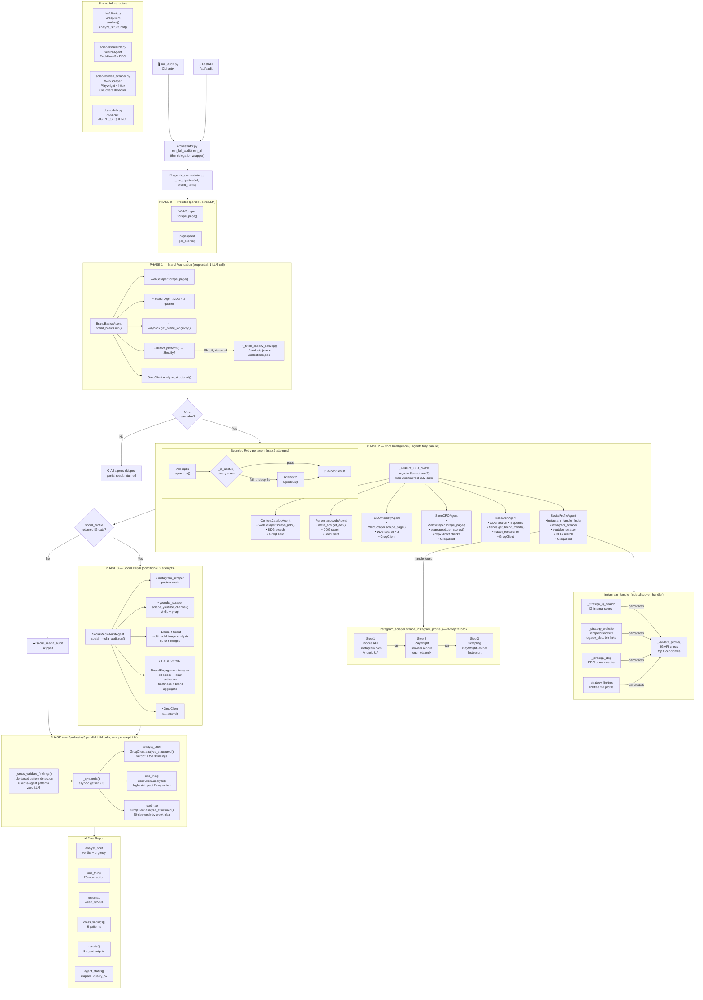

# SHOPOS Agent Architecture



## Agent Summary

| # | Agent | Key Tools | LLM Model | Quality Signal |
|---|-------|-----------|-----------|----------------|
| 1 | BrandBasicsAgent | WebScraper, DDG, Wayback, Shopify API | Groq | `analysis` exists |
| 2 | ContentCatalogAgent | WebScraper (PDPs), DDG | Groq | `analysis` or `pdps_scraped` |
| 3 | PerformanceAdsAgent | meta_ads, DDG | Groq | `analysis` or `ads_scrape` |
| 4 | GEOVisibilityAgent | WebScraper, DDG | Groq | `analysis` |
| 5 | StoreCROAgent | WebScraper, PageSpeed, httpx | Groq | `analysis` or `pagespeed` |
| 6 | ResearchAgent | DDG ×5, Trends, Tracxn | Groq | `analysis` |
| 7 | SocialProfileAgent | IG handle finder, IG scraper, YT scraper, DDG | Groq | `instagram.followers` or `bio` |
| 8 | SocialMediaAuditAgent | IG scraper, YT scraper, Llama 4 Scout, TRIBE v2 | Groq | `engagement_rate` or `content_themes` |

## Scraper Fallback Chains

```
instagram_scraper.scrape_instagram_profile()
  → mobile API (i.instagram.com, Android UA)
  → Playwright render (og: meta, no posts)
  → Scrapling PlayWrightFetcher (last resort)

instagram_handle_finder.discover_handle()
  → IG internal search
  → brand website scrape (og:see_also, bio links)
  → DuckDuckGo brand queries
  → Linktree profile scrape
  → validate top 8 candidates via IG API

WebScraper.scrape_page()
  → Playwright (headless Chrome, Cloudflare detection)
  → httpx fallback (static HTML)
```

## Key Design Principles (Greg Isenberg loop constraints)

- **Bounded retry**: max 2 attempts per agent, binary `_is_useful()` check, not open-ended
- **LLM calls**: 3 total (synthesis only) vs 30+ in old ReAct design
- **Parallel Phase 2**: 6 agents concurrent, gated at `Semaphore(2)` for Groq RPM
- **Hard abort**: brand URL unreachable → skip all 7 downstream agents
- **Conditional Phase 3**: `social_media_audit` skipped if `social_profile` returns no IG data
- **Rule-based cross-validation**: 6 patterns detected without LLM
